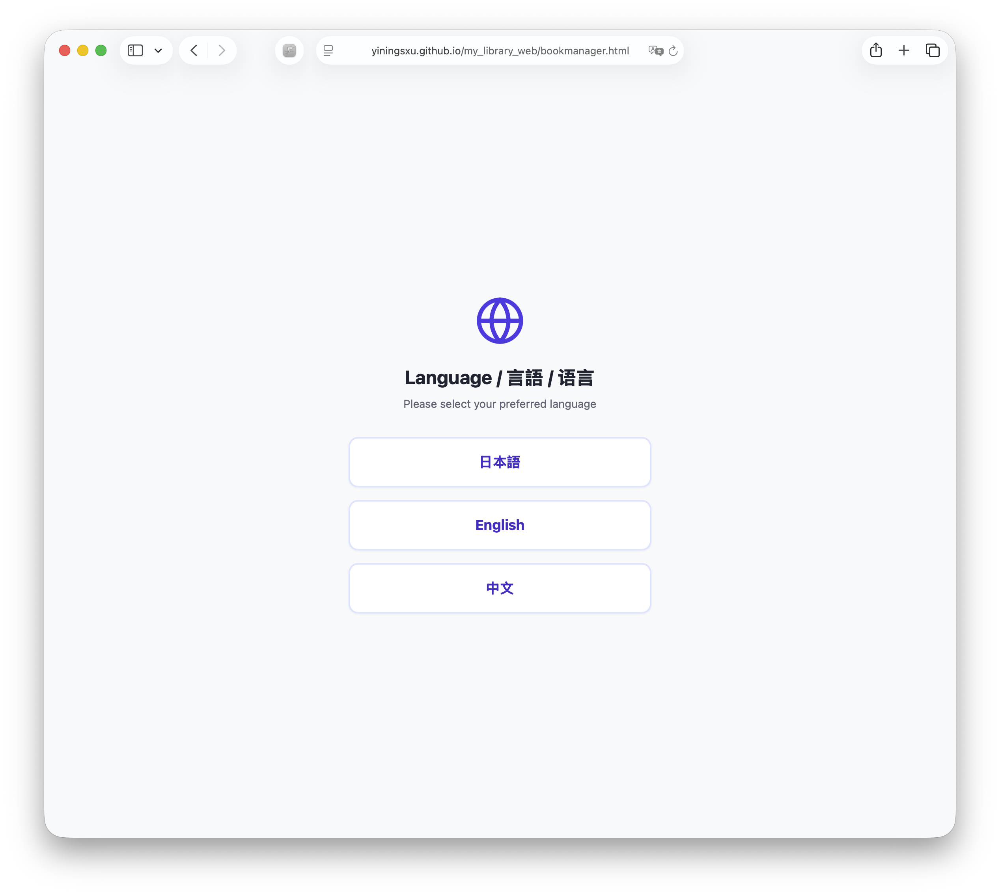
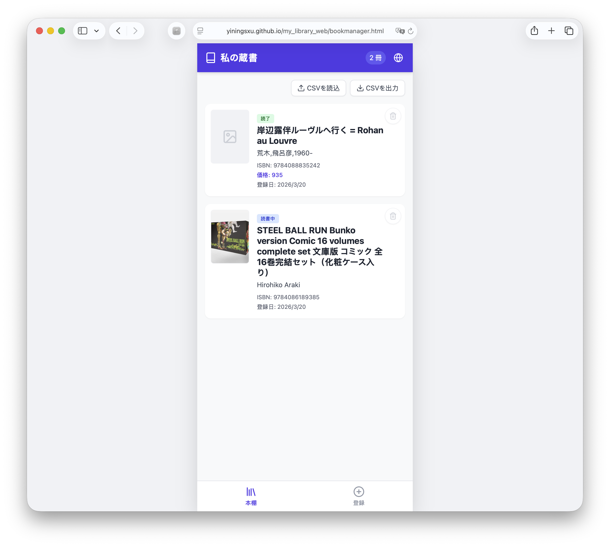
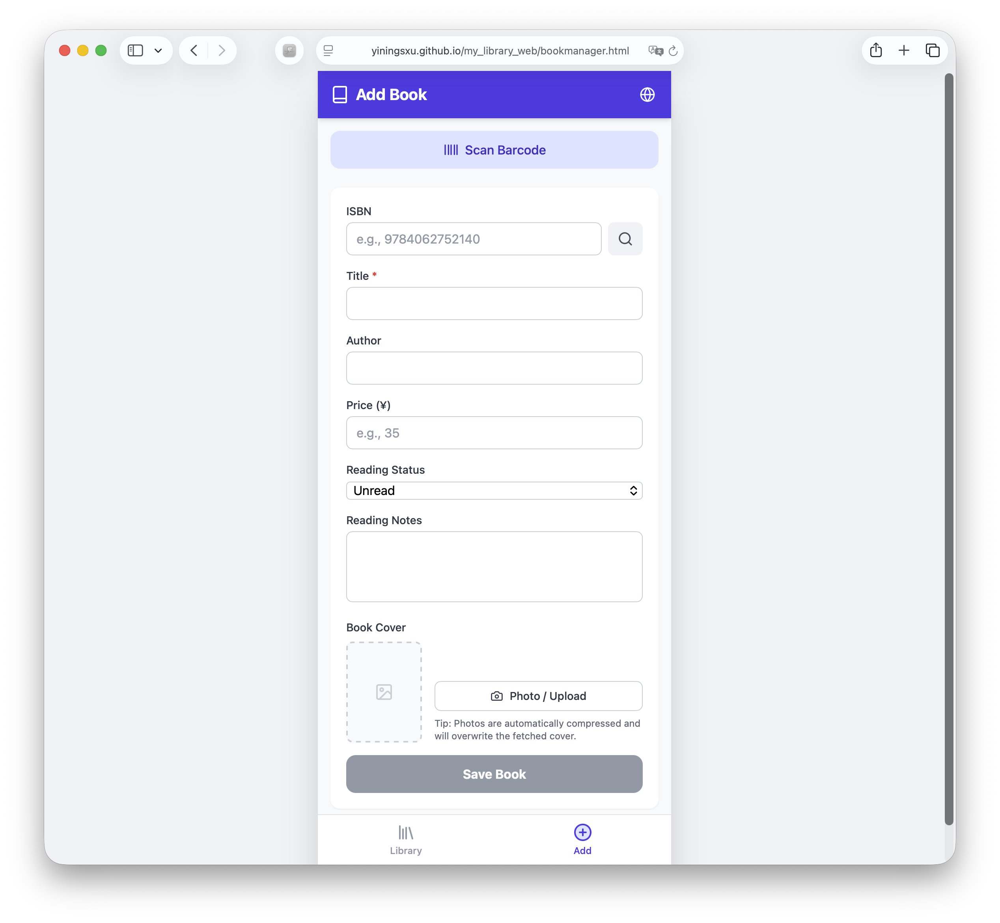

# MY LIBRARY

**Personal Book Collection Manager / 个人藏书管理器 / 個人蔵書管理アプリ**

A lightweight multilingual web app for managing your personal book collection with barcode scanning, ISBN metadata lookup, cover upload, reading status tracking, notes, and CSV import/export.  
一个轻量级的多语言个人藏书管理网页应用，支持条形码扫描、ISBN 书目信息获取、封面上传、阅读状态管理、读书感想记录，以及 CSV 导入导出。  
バーコード読み取り、ISBN 書誌情報取得、表紙画像アップロード、読書状況管理、感想メモ、CSV 入出力に対応した軽量な多言語個人蔵書管理 Web アプリです。

---

## Table of Contents

- [Features](#features)
- [Languages](#languages)
- [Tech Stack](#tech-stack)
- [Demo / Screens](#demo--screens)
- [Getting Started](#getting-started)
- [How to Use](#how-to-use)
- [Book Metadata Sources](#book-metadata-sources)
- [Storage](#storage)
- [CSV Format](#csv-format)
- [Image Handling](#image-handling)
- [Project Structure](#project-structure)
- [Planned Improvements](#planned-improvements)
- [License](#license)

---

## Features

- Multilingual interface: **English / 中文 / 日本語**
- Startup language selection
- Personal library view
- Add / edit book records
- Barcode scanning with camera
- Manual ISBN search
- Book metadata retrieval from external APIs
- Cover image upload or camera capture
- Reading status tracking
- Notes / impressions for each book
- CSV export / import
- Local browser storage fallback
- Optional Firebase Authentication + Firestore sync

---

## Languages

This project supports the following UI languages:

- **English**
- **简体中文 / 中文**
- **日本語**

Language can be selected from the startup screen.

---

## Tech Stack

- **HTML**
- **Vanilla JavaScript**
- **Tailwind CSS** (CDN)
- **Lucide Icons**
- **html5-qrcode**
- **Firebase**
  - Firebase App
  - Firebase Authentication
  - Cloud Firestore

---

## Demo / Screens

